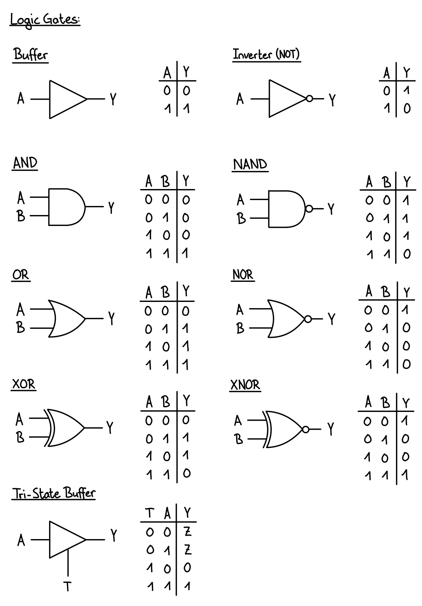
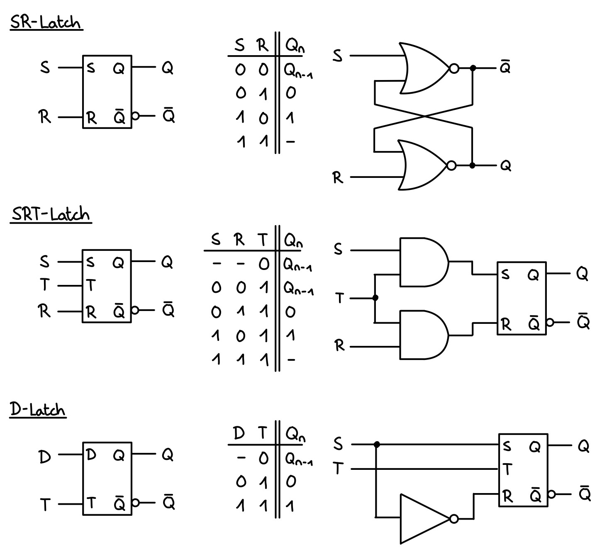
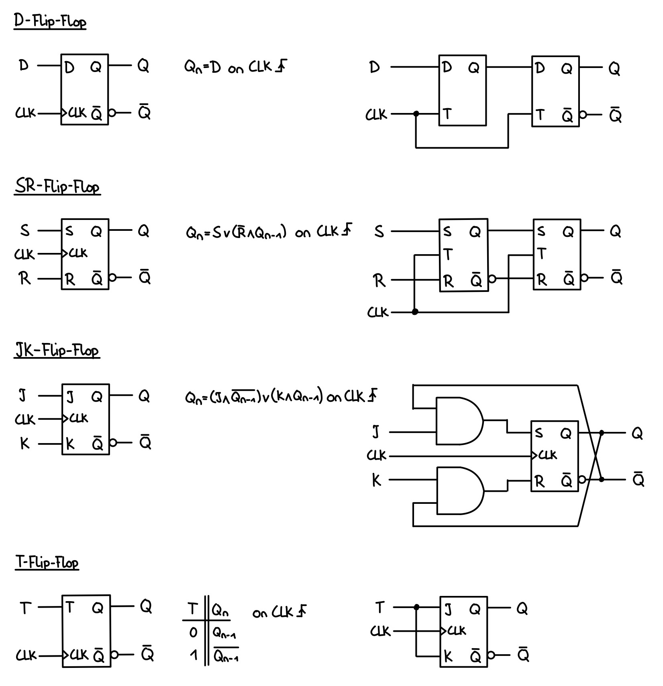
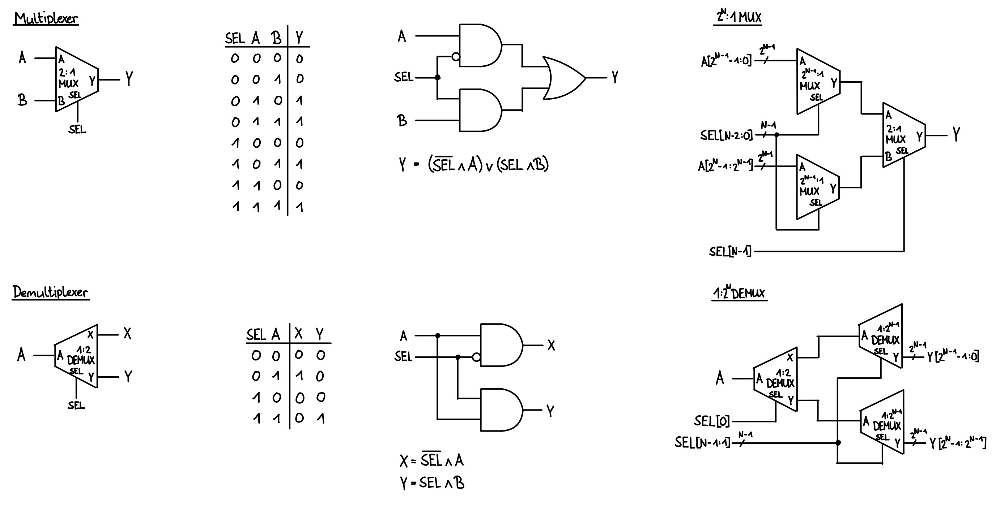
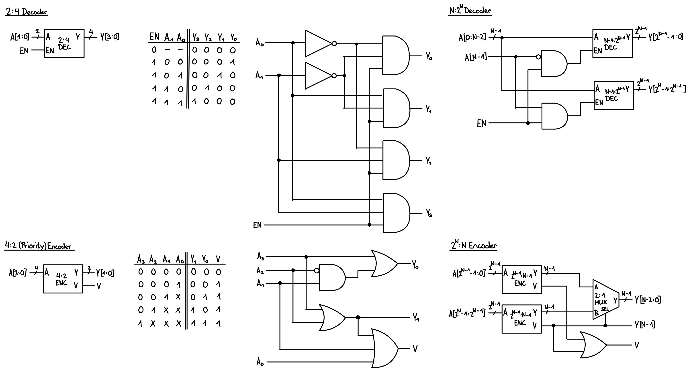

# Digital Design

## Boolean Logic

### Karnaugh Maps (KVD)

## Basic Digital Elements

### Logic Gates

### Latches

### Flip-Flops

## Basic Circuit Elements

### Multiplexers and Demultiplexers

### Encoders and Decoders

