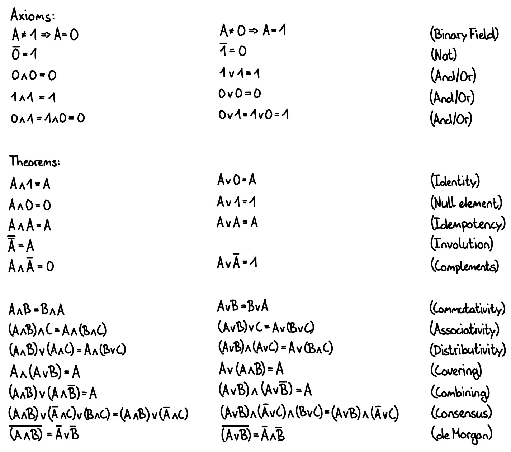
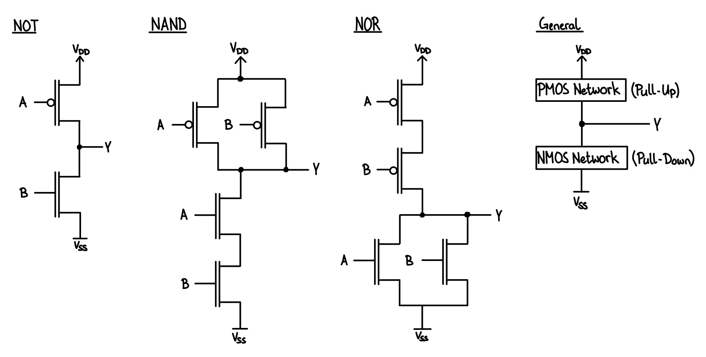
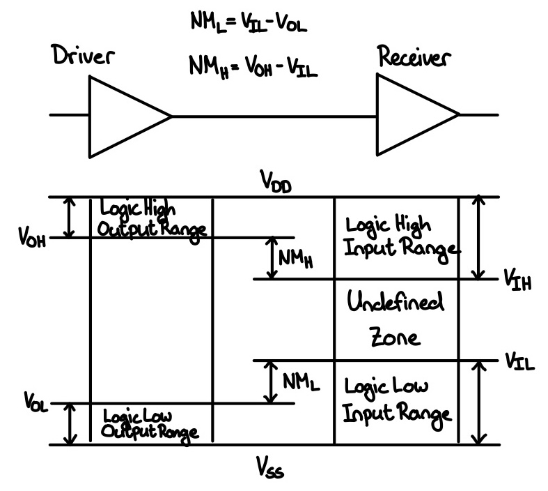

# Digital Design

## Boolean Logic

### Laws

### Karnaugh Maps (KVD)

## Transistors

### CMOS

### Logic Level Noise Margins

## Basic Digital Circuits

### Logic Gates

### Latches

### Flip-Flops

### Multiplexers and Demultiplexers

### Encoders and Decoders

